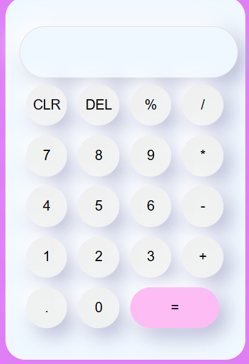

 #Calculadora Site : <a href="https://calculado-simples.netlify.app/"> 

<h1>
 
Uma calculadora desenvolvida com HTML, CSS e JavaScript, com visual moderno e responsivo. O projeto permite realizar operações básicas de forma intuitiva e com uma interface amigável para dispositivos móveis e desktops.
</h1>

 <h2>A interface da calculadora é moderna e responsiva, com botões arredondados e cores suaves: 
  

</h2>

 Funcionalidades : 

<h2>
✅ Inserção de números e operadores por cliques nos botões

✅ Cálculo de operações básicas: adição, subtração, multiplicação, divisão e porcentagem

✅ Botão CLR para limpar toda a entrada

✅ Botão DEL para apagar o último dígito

✅ Resultado exibido ao clicar em =

✅ Interface responsiva (adaptada para celular)

✅ Estilização com sombras, botões arredondados e cores suaves
</h2>

 
 Aprendizados: 

<h4>
-Durante o desenvolvimento deste projeto, foram reforçados conceitos como:

-Manipulação do DOM com JavaScript (getElementById, addEventListener, .value)

-Estruturas condicionais (switch, if)

-Expressões regulares simples para separar números e operadores

-Layout responsivo com CSS Grid e media queries

-Boas práticas de organização de código HTML, CSS e JS

-Uso de fontes externas com o Google Fonts
</h4>
